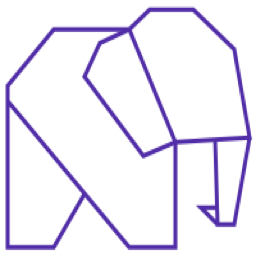

<p align="center">
  
</p>

# Phel Lang for VS Code

[](https://github.com/phel-lang/phel-vs-code-extension/actions/workflows/ci.yml)
[](https://marketplace.visualstudio.com/items?itemName=Phel-Lang.phel-lang)
[](https://marketplace.visualstudio.com/items?itemName=Phel-Lang.phel-lang)
[](https://github.com/phel-lang/phel-vs-code-extension/releases)
[](LICENSE)

VS Code support for [Phel](https://phel-lang.org/) - a functional Lisp that compiles to PHP.

## Why this extension

Writing Phel without editor support means colourless code, no completion for the 400+ symbols in `phel.core`, and dropping back to PHP-level debugging. This extension covers the full IDE flow.

- **Highlighting** - forms, macros, reader macros, tagged literals (`#inst`, `#regex`, `#php`, …) and reader conditionals (`#?(...)`).
- **Completion** for every public symbol in `phel.core` plus user `defn`/`defmacro`/`def` from anywhere in the workspace. Accepting a function in callee position fills in signature tabstops; cross-namespace symbols also auto-add the matching `:require`.
- **Hover & signature help** - markdown docstring, examples, and per-arity parameter highlight.
- **Go to / Find / Rename** - `F12` go-to-definition, `shift+F12` find-all-references, `F2` workspace rename, `cmd+T` go-to-symbol-in-workspace.
- **Diagnostics on save** via `phel analyze`; **format on save** via `phel format`.
- **REPL integration** - `Phel: Start REPL` opens an integrated terminal; `ctrl+enter` evals the form under the cursor in the file's namespace; history is appended to `.vscode/phel-repl-history.phel`.
- **Test Explorer + CodeLens** - every `deftest` shows up in the testing panel; inline `▶ Run test` lenses run a single deftest.
- **Paredit** - slurp/barf/raise/wrap commands; `cmd+shift+space` expands the selection by sexp.
- **Native debug adapter** - set breakpoints in `.phel` files; the adapter translates between Phel and the compiled PHP via Xdebug.
- **Snippets** for everyday scaffolding - `defn`, `let`, `cond`, `try`, `deftest`, `->`, …

## Install

In VS Code, open the Extensions sidebar (<kbd>Cmd</kbd>+<kbd>Shift</kbd>+<kbd>X</kbd> / <kbd>Ctrl</kbd>+<kbd>Shift</kbd>+<kbd>X</kbd>), search for **"Phel Lang"**, click **Install**. Or from the terminal:

```bash
code --install-extension Phel-Lang.phel-lang
```

Requires VS Code **1.75+**. Other paths (`.vsix` from GitHub releases, build from source, symlink for live development): see [docs/installation.md](docs/installation.md).

## First steps

1. **Open any `.phel` file** - highlighting kicks in automatically.
2. **Try completion** - start typing `re-` or `swap` and accept a suggestion.
3. **Run the REPL** - `cmd+shift+P` → `Phel: Start REPL`, then `ctrl+enter` over a form to eval it.
4. **Find & rename** - place the cursor on a symbol, press <kbd>F2</kbd> to rename it across the workspace, <kbd>shift+F12</kbd> to list every usage.
5. **Set a breakpoint** in `.phel`, add a launch config (see [docs/debugging.md](docs/debugging.md)), press <kbd>F5</kbd>.

## Tour

### Smart completion + auto-import

Type a workspace symbol's prefix; accept it, and the `(ns ...)` form is patched too:

```clojure
;; before
(ns my.app)

(println (slug-for "Hello World"))   ; <- typed `slug-` and accepted

;; after
(ns my.app
  (:require [my.app.text :refer [slug-for]]))

(println (slug-for "Hello World"))
```

Accepting a function in callee position fills in tabstops:

```clojure
;; type (asso → accept assoc
(assoc m k v)
;       ^   ^   ^   tab through m, k, v
```

### Hover & signature help

```text
┌────────────────────────────────────────────────────────────┐
│ assoc                                                       │
│ (assoc m k v)                                               │
│ (assoc m k v & kvs)                                         │
│                                                             │
│ Returns a new map with the key/value pairs assoc'd onto m.  │
│                                                             │
│ Example: (assoc {:a 1} :b 2) ;=> {:a 1 :b 2}                │
│ See also: dissoc, get, update                               │
└────────────────────────────────────────────────────────────┘
```

### REPL with `(in-ns)` follow

```text
$ phel repl
phel> ;; cursor in src/app/core.phel, ctrl+enter on:
(defn greet [name] (str "Hello, " name))
;=> nil

;; jump to src/app/util.phel, ctrl+enter on:
(reverse [1 2 3])
;; extension first sends:
(in-ns 'app.util)
;=> [3 2 1]
```

History trail in `.vscode/phel-repl-history.phel`:

```clojure
;; 2026-05-07T08:42:11.231Z
(defn greet [name] (str "Hello, " name))

;; 2026-05-07T08:42:34.118Z
(reverse [1 2 3])
```

### Paredit

```text
;; cursor in (a)         slurp-forward      → (a b)
(a) b                    ─────────────►     (a b)

;; cursor inside         barf-forward       → (a b) c
(a b c)                  ─────────────►     (a b) c

;; cursor on bar         raise              → (foo bar)
(foo (bar baz))          ─────────────►     (foo bar)
```

`cmd+shift+space` grows the selection by sexp; again, again until you hit the top-level form.

### Refactoring

| Action | Key | Scope |
|---|---|---|
| Go to definition | `F12` | workspace + bundled `phel.core` |
| Find all references | `shift+F12` | workspace |
| Rename | `F2` | workspace |
| Outline | `cmd+shift+O` | current file |
| Symbol search | `cmd+T` | workspace |

### Test Explorer

```text
TESTING
└─ src/app/core_test.phel
   ├─ ✓ greet-basic         (124 ms)
   ├─ ✓ greet-empty-name    (87 ms)
   └─ ✗ greet-i18n          (assertion failed: expected ...)
```

Inline `▶ Run test` lenses run a single `deftest` from the editor.

## Documentation

| Topic | Link |
|---|---|
| Installation paths | [docs/installation.md](docs/installation.md) |
| Syntax highlighting reference | [docs/syntax.md](docs/syntax.md) |
| Completion & snippets | [docs/completion.md](docs/completion.md) |
| REPL & paredit | [docs/repl-and-paredit.md](docs/repl-and-paredit.md) |
| Refactoring (rename / refs / symbols) | [docs/refactoring.md](docs/refactoring.md) |
| Debugging with Xdebug | [docs/debugging.md](docs/debugging.md) |
| Tracing with `tap>` | [docs/taps.md](docs/taps.md) |
| Settings reference | [docs/settings.md](docs/settings.md) |
| Troubleshooting | [docs/troubleshooting.md](docs/troubleshooting.md) |
